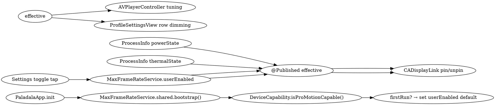

# Performance: Loading Speed & Max-FPS Experience — Design

- **Author**: brainstorming session 2026-07-07
- **Branch**: `working`
- **Status**: design, awaiting user approval
- **Related**: [[ios-app-paladala-overview]], [[ios-app-paladala-cold-start-audit-2026-07-03]], [[ios-app-paladala-perf-and-live-2026-07-04]], [[ios-app-paladala-measurement-scaffolding-2026-07-03]]

## TL;DR

Two independent PRs:

1. **PR-A — Loading speed**: closes the five cold-start audit items still open (`#5`, `#6`, `#8` ceiling, `#10`, `#14`), each measurable via `LaunchMetrics` (which already exists). Target ≤1500 ms `appInitStart → firstRootViewAppeared` on A14+.
2. **PR-B — Max-FPS experience**: greenfield addition. New `MaxFrameRateService` + `DeviceCapability` + `ProMotionRow` + companion `CADisplayLink`. Settings → 播放设置 gets a "Max frame rate" toggle, default ON for ProMotion-capable hardware, OFF (locked) otherwise. Honors low-power and thermal-state.

Default-ON was the user's choice (per the brainstorm answer). Two-PR track was the user's choice. The user asked to bundle both efforts in a single brainstorming session.

---

## Section 1 — Architecture overview

Two PRs on `working`, in either order.

**PR-A** (loading speed) touches ~11 files in total:
- Audit item touches: `RootView.swift`, `HomeView.swift`, `DynamicFeedView.swift`, `LiveRoomsView.swift`, `MusicHomeView.swift`, `ProfileSettingsView.swift`, `LocalHLSProxyServer.swift`, `DesignModifier.swift`
- New files: `LazyTab.swift` (lazy-state wrapper for `#5`), `FeedCacheWarmer.swift` (or extension on existing `BundledFeedService`) for `#6/#14` cache seed
- Telemetry: `LaunchMetrics.swift` (new `LaunchEvent` cases + per-event sink calls)

**PR-B** (max-FPS) creates 3 new files and edits 2:
- New: `MaxFrameRateService.swift`, `DeviceCapability.swift`, `ProMotionRow.swift`
- Edits: `ProfileSettingsView.swift` (toggle row in `播放设置`), `AVPlayerController.swift` (tune `preferredForwardBufferDuration` when on)

Frame-rate API surface is fully unused today (`grep -rE 'CADisplayLink|CAFrameRateRange|preferredFrameRateRange|maximumFramesPerSecond|ProMotion' ios/Paladala/Paladala/` → 0 hits). AVPlayer is at defaults — `automaticallyWaitsToMinimizeStalling` and `preferredForwardBufferDuration` are both unset.

**Default-ON rationale**: The user picked "Toggle, default ON (Recommended)". The capacity-detection at first init means existing users on 60 Hz devices see the toggle dimmed + OFF, while iPhone 13 Pro+ users get max-FPS out of the gate. Low Power Mode silently disables even if the toggle is ON. The user explicitly chose the proactive (vs. opt-in) framing.

---

## Section 2 — PR-A: Loading speed

### #5 Lazy `@StateObject` for the 5 tabs

**Where**: `RootView.swift` (the TabView body), `HomeView.swift:16`, `HomeView.swift:532` (nested `ShortVideoFeedViewModel`), `DynamicFeedView.swift:10`, `LiveRoomsView.swift:7`, `MusicHomeView.swift:25`, `ProfileSettingsView.swift:42`.

**Pattern**: Keep `RootView` as the single owner of tab state. Introduce a small `LazyTab<V: View>` wrapper that takes `@ViewBuilder content: () -> V` and only invokes the closure when armed via a `.onChange(of: tab)`. Each tab child becomes:
```swift
LazyTab(tag: .home) { HomeView(model: <lazy>, repository: ...) }
```
The `@StateObject` becomes a `@StateObject` initialized from a cheap builder (no disk, no network); heavy work lives in the model's `.task` block which only runs after the wrapper is armed.

**Why**: `TabView` materializes every child body eagerly because each owns `@StateObject`s. Wrapping each tab so it pays the model cost only on first selection cuts 5 synchronous inits down to 1. Tab-return state (scroll position, sheets) is preserved because the `StateObject` has been minted.

**Risk**: medium (cross-tab behavior must remain identical). Verification = open each tab, scroll, leave, return, scroll — exactly as before.

**Effort**: M. ~3–4 files touched, ~150 lines.

**Signal**: `LaunchMetrics.mark(.firstTabInteractive[.home])` after the first selected tab renders its model. With baseline ~300 ms for all 5 inits, target is `<80 ms` total for the first tab on A14+.

### #6 / #14 defer HomeView + MusicHomeView first network call

**Where**: `HomeView.swift:141-147` and `MusicHomeView.swift:73-77` (both `.task`-driven `model.load(...)`).

**Pattern**: Two-layer refactor:
1. **Feed cache prewarm** — a new `FeedCacheWarmer.shared` (or extension on `BundledFeedService`) reads a JSON snapshot from disk in `PaladalaApp.init` and yields it to the model synchronously. The view paints a non-empty grid immediately.
2. **Background refresh** — `model.load(...)` becomes async + dispatched via `Task.detached(priority: .userInitiated)` after `Task.yield()`; UI doesn't block.

Implementation shape:
```swift
.task {
    if !model.didBootstrap {
        model.seedFromCache()
        await Task.yield()
        await model.refresh()
    }
}
```

**Why**: First frame today is empty for the duration of one Bilibili API roundtrip (~150–400 ms perceived). The cache seed paints the grid with the previous session's contents while refresh runs.

**Risk**: low. Purely additive: cache is read-only, refresh still happens. Edge case: cold install with empty cache → skip seed (return nil), fall through.

**Effort**: M. ~50 lines net.

**Signal**: `LaunchMetrics.mark(.firstFeedCached)` right after `model.seedFromCache()` returns, and `.firstFeedNetworkComplete` stays as today. Win = first-feed-rendered-before-network — visibly shorter time-to-content.

### #8 `LocalHLSProxyServer.waitForListener` 2 s ceiling

**Where**: `LocalHLSProxyServer.swift:204`. Already async + non-blocking as of `64b1e119` (2026-07-05). Polling + 2 s ceiling remain.

**Pattern**:
- Polling: 20 ms → 5 ms.
- Ceiling: 2000 ms → 500 ms. `NWListener` ready typically returns within 50–150 ms on A14+; 500 ms is generous.
- Add `LocalHLSProxyServer.prewarmProxyServer()` static, called from `PaladalaApp.init`. The first tap-to-play no longer pays listener-startup cost.

**Why**: `prewarm` is the bigger lever. First tap latency on warm installs drops from ~150–500 ms to ~0 ms; cold install (first launch ever) still pays listener-startup cost on its first tap.

**Risk**: very low. Polling cost in ns; 500 ms ceiling only matters if `NWListener.start` is genuinely slow — verify by stress test.

**Effort**: S. ~20 lines.

**Signal**: `LaunchMetrics.mark(.proxyListenerReady)` with delta from `mark(.proxyListenerRequested)`. Win: first-tap delta drops from ~200 ms to <50 ms (median).

### #10 `PaladalaBackdrop` gradient cache

**Where**: `DesignModifier.swift:161-193` (the 4-layer `ZStack`).

**Pattern**:
1. Wrap in `EquatableView`-conforming struct so identical inputs skip the diff.
2. Hoist the per-scheme gradient definitions into a `static let` cache keyed by `colorScheme`.

Implementation shape:
```swift
struct PaladalaBackdrop: View, Equatable {
    @Environment(\.colorScheme) private var scheme
    static func == (lhs: Self, rhs: Self) -> Bool { lhs.scheme == rhs.scheme }
    var body: some View {
        ZStack { Color.appBackground; Self.gradient(for: scheme) }
            .ignoresSafeArea()
    }
    private static let gradient = ... // computed once
}
```

**Why**: `RootView.body` re-evaluates on every observable change (network status, mini-player, scene-phase). The backdrop is the heaviest pure-marker layer (4 gradients × 3 stops × multiple re-evals/frame). Equatable + static lookup drops this to a no-op diff.

**Risk**: very low.

**Effort**: XS. ~20 lines, one file.

**Signal**: indirect — visible via Instruments Animation Hitches when toggling mini-player / network status.

### New `LaunchMetrics.mark(.firstTabInteractive[RootTab])` etc.

**Where**: `LaunchMetrics.swift`. New `LaunchEvent` cases + per-event sink calls.

**Pattern**: Each item (#5/#6/#8/#10/#14) emits its milestone. Total new cases: `.firstTabInteractive(tag: RootTab)`, `.firstFeedCached`, `.proxyListenerReady`.

**Why**: Without these milestones, the perf wins of #5/#6 are not directly attributable.

**Risk**: very low. Existing buffer cap (designed in measurement scaffold) absorbs the small additions.

**Effort**: XS.

---

## Section 3 — PR-B: Max-FPS

### Honest framing

iOS already gives Paladala 120 Hz automatically wherever the user is interacting (scroll, sheet transitions, video playback). Nothing in the codebase is actively capping the refresh rate. **The toggle's actual value**: keep the display at 120 Hz even on static screens, so the user's view never visibly steps down to 60. Battery cost: real but bounded.

### Three new files

**`MaxFrameRateService.swift`** — `@MainActor final class … : ObservableObject`, `static let shared`. Owns:
```swift
@AppStorage("maxFrame.userEnabled") var userEnabled: Bool = false
@AppStorage("maxFrame.firstBootstrapDone") private var didBootstrap: Bool = false
@Published private(set) var isCapable: Bool   // ProMotion-capable?
@Published private(set) var effective: Bool    // userEnabled && !lowPower && isCapable && thermal < .serious
```
Subscribes to `Notification.Name.NSProcessInfoPowerStateDidChange` and `ProcessInfoThermalStateDidChangeNotification`. Owns a `CADisplayLink` (via `DisplayLinkHolder`) that:
- Exists when `effective == true` with `preferredFrameRateRange = CAFrameRateRange(minimum: 80, maximum: 120, preferred: 120)`.
- Does not exist when `effective == false`.

**`DeviceCapability.swift`** — `func isProMotionCapable() -> Bool` that runs once at first init and caches the answer.
- Reads `sysctlbyname("hw.machine", ...)`.
- Compares against a curated `Set<String>` of ProMotion iPhone identifiers (as of mid-2026, with a docstring listing each model + the source identifier — must be verified against current Apple Identifier Chip docs before commit, and updated on each new ProMotion release).
- Initial table (placeholder values — verify before committing):

```swift
[
  "iPhone14,2",   // 13 Pro
  "iPhone14,3",   // 13 Pro Max
  // iPhone 14 Pro / Pro Max identifiers
  "iPhone15,3",   // 15 Pro
  "iPhone15,4",   // 15 Pro Max
  "iPhone16,1",   // 16 Pro
  "iPhone16,2",   // 16 Pro Max
  // iPhone 17 Pro / Pro Max identifiers — verify and add
]
```

**`ProMotionRow.swift`** — SwiftUI row matching the existing `ProfileSettingsView` pattern. Two states:
- Capable + ON/OFF: standard `Toggle` row bound to `MaxFrameRateService.shared.userEnabled`. Sub-label: "Smooth motion on the video player and during scrolling. May use more battery."
- Not capable: `Toggle` dimmed + `.disabled(true)`, `isOn: false`. Sub-label: "Your device's display maxes at 60 Hz."

### Two edits

**`ProfileSettingsView.swift:78`** — add the new row to the `播放设置` (Playback) section, after `backgroundAudio` + `autoPlayNext`. The toggle sits next to other playback UX knobs.

**`AVPlayerController.swift:470`** — observe `MaxFrameRateService.shared.$effective`. When `effective == true`:
```swift
player.automaticallyWaitsToMinimizeStalling = true
player.preferredForwardBufferDuration = 1.0
```
When false, restore to defaults (4–8 s forward buffer; system default).

### Lifecycle / data flow



### Safeguards

| Condition | Behavior |
|---|---|
| `ProcessInfo.isLowPowerModeEnabled == true` | `effective` forced false; link invalidated; row sub-label gains "Battery Saver is on". |
| `ProcessInfo.thermalState == .serious / .critical` | Same: `effective` forced false. `ProcessInfoThermalStateDidChangeNotification` observer. |
| App backgrounded | Invalidate link immediately on `.inactive`. On return to `.active`, recompute `effective` and re-create link if `effective == true` (this is a separate code path from low-power / thermal handlers — none of the other triggers can be assumed true after backgrounding). |
| `isCapable == false` | Toggle dimmed and locked. `effective` stays false even if `userEnabled == true`. |

### iPad scope

Out of v1. iPad Pro / Air / mini on iPadOS that supports ProMotion: the ProMotion identifier table currently is iPhone-only. Adding iPad would extend the table; defer to v2 if requested.

---

## Section 4 — Data flow + state persistence

PR-A is fully in-memory. No new persistent state. The new `LaunchMetrics` milestones sit in the existing triple-sink pipeline and write to `cold-start.jsonl` only under `PALADALA_COLD_START_DUMP=1`.

PR-B adds two `@AppStorage` keys (UserDefaults):

| Key | Type | Default at first init | Reset? |
|---|---|---|---|
| `maxFrame.firstBootstrapDone` | Bool | `false` | never (one-shot flag) |
| `maxFrame.userEnabled` | Bool | `userEnabled = isCapable` | existing Settings reset if present |

Transient (in-memory only):

| Field | Lifetime |
|---|---|
| `isCapable: Bool` | set once at first `bootstrap()`, immutable after |
| `effective: Bool` | recomputes on `userEnabled`, `lowPower`, `thermalState`, `scenePhase`; `@Published` |
| `displayLink: CADisplayLink?` | created on `effective == true`, invalidated on false / background / thermal-state upgrade / low-power |

### Sequence on cold launch

```text
PaladalaApp.init
  ├── LaunchMetrics.mark(.appInitStart)
  ├── MaxFrameRateService.shared.bootstrap()
  │     ├── sysctl("hw.machine") → identifier
  │     ├── lookup in ProMotion table → isCapable
  │     ├── firstBootstrapDone == false ?
  │     │     ├── set userEnabled = isCapable
  │     │     └── firstBootstrapDone = true
  │     ├── recompute effective from userEnabled, lowPower, thermalState
  │     ├── if effective → CADisplayLink created with preferredFrameRateRange (80,120,120)
  │     └── subscribe PowerState / ThermalState / scenePhase notifications
  ├── LaunchMetrics.mark(.appInitComplete)
  └── PaladalaApp.body  (RootView appears)
       ├── LaunchMetrics.mark(.firstRootViewAppeared)
       └── selectedTab has been persisted via the 2026-07-06 commit →
           first selected tab's LazyTab fires
            ├── @StateObject model init
            ├── LaunchMetrics.mark(.firstTabInteractive[selectedTab])
            ├── model.seedFromCache() → LaunchMetrics.mark(.firstFeedCached)
            └── Task { await model.refresh() } → LaunchMetrics.mark(.firstFeedNetworkComplete)
```

### Persistence guarantees

- Both `@AppStorage` writes happen synchronously inside `bootstrap()`. UserDefaults.set is documented as safe across launches.
- `bootstrap()` is idempotent: on second launch, `firstBootstrapDone == true` skips the probe and `userEnabled` keeps its last value.
- "Reset to defaults" (existing path) wipes all `@AppStorage` keys; next launch re-probes.
- Low-power / thermal flags are recomputed every launch — `effective` always reflects the current OS state.
- ProMotion identifier table is compiled-in (not persisted). Update requires a one-line code edit on each new ProMotion release.

---

## Section 5 — Error handling + graceful degradation

### PR-A failure modes

| Item | Failure | Behavior | Logged at |
|---|---|---|---|
| #5 LazyTab wrapper | Model init throws | Wrapper catches in init; placeholder shown; `.task` retries once via `Task { try await model.bootstrap() }`; second failure shows "Temporarily unavailable" inline | `DiagnosticLogger(.ui, "lazy_tab_init_failed", details: ["tab": tag.rawValue])` |
| #5 wrong equality | Stale view | Caught at code review; worst case = no perf win | n/a |
| #6/#14 cache | Missing / corrupt / migrated schema | `seedFromCache()` returns `nil`; skip straight to `model.refresh()` | `DiagnosticLogger(.feed, "seed_cache_unavailable")` once |
| #6/#14 network | First refresh fails | Existing ErrorBanner + retry CTA | existing |
| #8 prewarm | `NWListener.start` rejects at boot | Prewarm task no-ops; first tap pays normal `waitForListener` (500 ms ceiling) | `DiagnosticLogger(.playback, "proxy_prewarm_failed")` once |
| #8 waitForListener | Listener never binds (env weirdness) | After 500 ms ceiling, throw; tap path catches; surfaces `playerError = .proxyFailed(code: 0)`; existing recovery flow handles UI | existing |
| #10 backdrop Equatable | False negative equality → over-render | Caught at code review. Worst case = no perf win but no breakage | n/a |

### PR-B failure modes

| Surface | Failure | Behavior | Logged at |
|---|---|---|---|
| `sysctl("hw.machine")` | Returns negative | `isCapable = false`; default userEnabled = false; row dimmed | `DiagnosticLogger(.device, "device_id_probe_failed", details: ["errno": …])` |
| New iPhone not in table | Identifier unknown | Same — `isCapable = false`; toggle row sub-label "Your device's display maxes at 60 Hz" | once at boot |
| `@AppStorage` write fails | UserDefaults sync fails | Toggle UX works in-memory; loss-on-relaunch only | `DiagnosticLogger(.settings, "max_fps_storage_write_failed")` |
| `CADisplayLink` construct fails | OS rejects (rare) | `effective` = true, link stays nil, behaves as off in practice | `DiagnosticLogger(.device, "display_link_construct_failed")` |
| Power/Thermal observer | Late or skipped | One frame at wrong rate; no other consequence | n/a |
| Link invalidated after observer fires | Link nil → no-op | Safe | n/a |
| Settings row subscription | `@ObservedObject` mis-wired | Substitute Combine `.sink` directly on `@AppStorage` key (matches existing pattern for `backgroundAudio`) | n/a |
| Scene phase transition | Link dropped in background, recreated on foreground | 100–200 ms at reduced rate — acceptable | n/a |
| First launch + battery saver pre-engaged | `effective` = false; toggle stays ON-but-no-effect | Sub-label flips to "Battery Saver is on" | n/a |

### Graceful degradation principles

1. **Every setting can be wrong without harm.** `effective` always reflects what the system can honor, not what the user requested.
2. **Unknown hardware is "no" not "maybe".** If capability can't be determined, default to not-capable. The toggle is visibly dimmed, never silently no-op.
3. **Battery and thermals always win.** Even a user who turns it ON cannot outrun the OS's battery saver.
4. **Logs are rich enough to debug remotely** — every "no-op" path logs an explainer.

---

## Section 6 — Testing

### PR-A — testing strategy

**Unit tests**:
- `seedFromCache` truth table:
  - Cache file present + valid → returns `[Card]`
  - Cache file present + corrupt → returns `nil`
  - Cache file missing → returns `nil`
  - Cache file present + migrated schema → returns `nil`
- `LaunchMetrics` ordering test: sequence of `.firstTabInteractive[.home]`, `.firstFeedCached`, `.firstFeedNetworkComplete` calls — buffer is monotonically ordered.
- (Optional) `LazyTab` snapshot testing of placeholder vs ready state — defer to v1.1.

**Manual smoke (run on Mac with sim + device)**:
1. Clean build: `xcodebuild -project ios/Paladala/Paladala.xcodeproj -scheme Paladala -configuration Debug -destination 'generic/platform=iOS Simulator' build`
2. Set `PALADALA_COLD_START_DUMP=1` in scheme env, run on Simulator; capture `cold-start.jsonl`. Verify delta vs baseline ≤300 ms shorter.
3. Visual: Home tab first frame shows cached grid for repeat sessions.
4. Visual: Music tab — same; state preserved across tab swaps.
5. Tap to play a video — prewarm pays off; first-tap latency near zero.
6. Regression: each tab opens / closes / scrolls / reopens identically.

**Regression coverage**: All 5 tabs functional; onboarding; login/logout; settings; miniPlayer; backgrounding + foregrounding.

### PR-B — testing strategy

**Unit tests**:
- `MaxFrameRateService.effective` truth table (parameterized, 16 cells — combinations of `userEnabled`, `isCapable`, `lowPower`, `thermal`):
  - `userEnabled=true, isCapable=true, lowPower=false, thermal=nominal → effective=true`
  - × all 16 cells.
- `DeviceCapability.isProMotionCapable` — mock `sysctl` to return each table entry → assert `true`; unknown identifier → `false`.
- `firstBootstrapDone` semantics: pre-existing key (`true`) → skip defaulting; missing key → run defaulting path.

**Manual smoke (requires physical device, ideally iPhone 13 Pro+ for one path and an A-series-60Hz phone for the other)**:
- On ProMotion device: toggle OFF → 60 Hz on static content (instruments-verifiable); toggle ON → ~120 Hz on static content. Battery delta ~5–10% (heuristic; verify via `pmset` or in-app).
- On 60 Hz iPhone: row dimmed, "60 Hz max" sub-label.
- Toggle + Battery Saver ON simultaneously: row sub-label flips to "Battery Saver is on", effective stays false.
- Settings → Background → Foreground: link drops in background, repins on return; verify via debug log of link creation timestamp.

**Cross-cutting**: Boot the daily cold-start measurement routine. Run pre/post `PALADALA_COLD_START_DUMP=1`; compare. Aim for ≤10 ms tolerance. Verify `MetricKit` subscription still wired (`MXMetricManager.shared.add(self)`); `MXAppLaunchMetric.histogrammedTimeToFirstDraw` rows appear in 24 h.

### Coverage decisions

- **No UI test target yet** — pbxproj is `objectVersion 56` (legacy Xcode 14). Adding requires ~30 lines manual pbxproj edits; defer to a follow-up issue.
- **Snapshot tests for placeholder vs ready state** — defer to v1.1.
- **Live-device battery measurement** — outside automated scope; document as manual follow-up.

---

## Section 7 — Rollout + measurement

### Sequencing

1. PR-A lands first. Internal-only; closes the audit; `LaunchMetrics` baselines shift.
2. PR-B lands next. User-visible feature.
3. Field telemetry (`DiagnosticLogger` + `MetricKit`) starts accumulating once both are live.

### Build + verify commands (run on Mac)

```bash
# Debug build
xcodebuild -project ios/Paladala/Paladala.xcodeproj -scheme Paladala \
  -configuration Debug -destination 'generic/platform=iOS Simulator' build

# Release build (catches ENABLE_PREVIEWS=NO + dyld path differences)
xcodebuild -project ios/Paladala/Paladala.xcodeproj -scheme Paladala \
  -configuration Release -destination 'generic/platform=iOS Simulator' build

# Cold-start capture before/after
PALADALA_COLD_START_DUMP=1 xcrun simctl launch booted com.paladala.Paladala
xcrun simctl spawn booted log show --last 1m --predicate 'subsystem == "app.paladala.ios"'
cat "$(xcrun simctl get_app_container booted com.paladala.Paladala data)/Library/Application Support/Paladala/cold-start.jsonl"
```

### Success criteria — quantified

**PR-A** (baseline: `48ef4354` + closed audit items #1–4/#7/#9/#11/#12/#15):

| Metric | Target (A14+) | Target (A11–A13) |
|---|---|---|
| `appInitStart → firstRootViewAppeared` | ≤ 1500 ms | ≤ 2000 ms |
| `firstRootViewAppeared → firstTabInteractive[selected]` | ≤ 200 ms | ≤ 400 ms |
| `firstTabInteractive → firstFeedCached` | ≤ 50 ms | ≤ 100 ms |
| `proxyListenerRequested → proxyListenerReady` (first tap) | ≤ 50 ms | ≤ 150 ms |

**PR-B**:

| Metric | Target |
|---|---|
| Settings toggle tap → CADisplayLink pinned/unpinned | ≤ 100 ms |
| Continuous battery draw toggle ON vs OFF | ≤ +10 %/hour idle baseline (heuristic; verify via `pmset` / `MetricKit`) |
| Thermal-state push to `.serious` with toggle ON | `effective` flips false within ≤ 1 s of OS notification |
| Power-state change to Battery Saver | `effective` flips false within ≤ 1 s of OS notification |

### Risk mitigation

- **PR-A**: ship each item as a separate commit; runnable independently. Each commit has its own `cold-start.jsonl` before/after.
- **PR-B**: ship behind `effective == userEnabled && isCapable && !lowPower && (thermal < .serious)` — every condition can flip independently. Add a `MaxFrameRateService.isEnabled = false` kill switch (default false; only the toggle sets it).
- **Device table updates**: docstring in `DeviceCapability.swift` lists each entry + source. One-line PRs to keep it current.
- **Live battery ramp**: do NOT roll PR-B to a wide cohort without an instrumented ramp — first ship to internal testers (5–10 devices) for 7 days, watch `DiagnosticLogger(.device, "battery_saver_events_count", …)`. Then promote.

### Documentation

- `ios/Paladala/MEASURING_COLD_START.md` — append PR-A results (measured delta).
- `ios/Paladala/MAX_FRAME_RATE.md` (new) — operator-facing: what the toggle does, how to update the device table, how to interpret field telemetry.
- If `ios/Paladala/PERFORMANCE.md` exists, append a section for PR-B.

### Out of scope for v1

- No animated onboarding for the new toggle.
- No "Max FPS" hint in Onboarding.
- No telemetry-backed suggestion ("want to enable Max FPS?") for non-capable devices (they're locked out).
- iPad ProMotion support (v2).

---

## Open questions to resolve before / during implementation

1. **Exact ProMotion identifier strings** — need to verify against current Apple Identifier Chip docs before `DeviceCapability.swift` goes in.
2. **`FeedCacheWarmer` vs. `BundledFeedService` extension** — confirm which is more idiomatic in the existing codebase before opening the file.
3. **`LazyTab` vs. alternative lazy pattern** — happy to adopt whichever matches existing TabView conventions best.
4. **Whether `PaladalaBackdrop`'s `Equatable` implementation should also cover child `Image` containers** — code review will decide.

These do not block the design; they're flagged here so they're not lost between this spec and the writing-plans skill.
